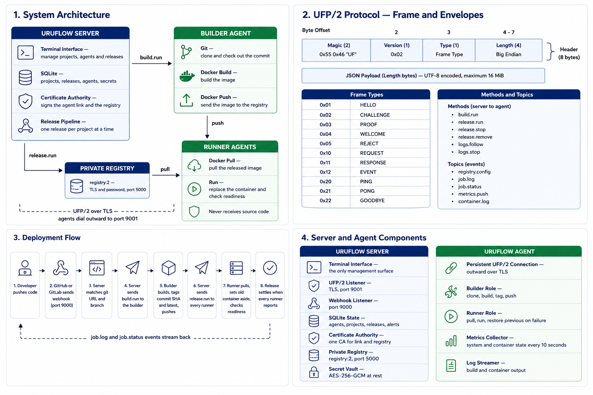
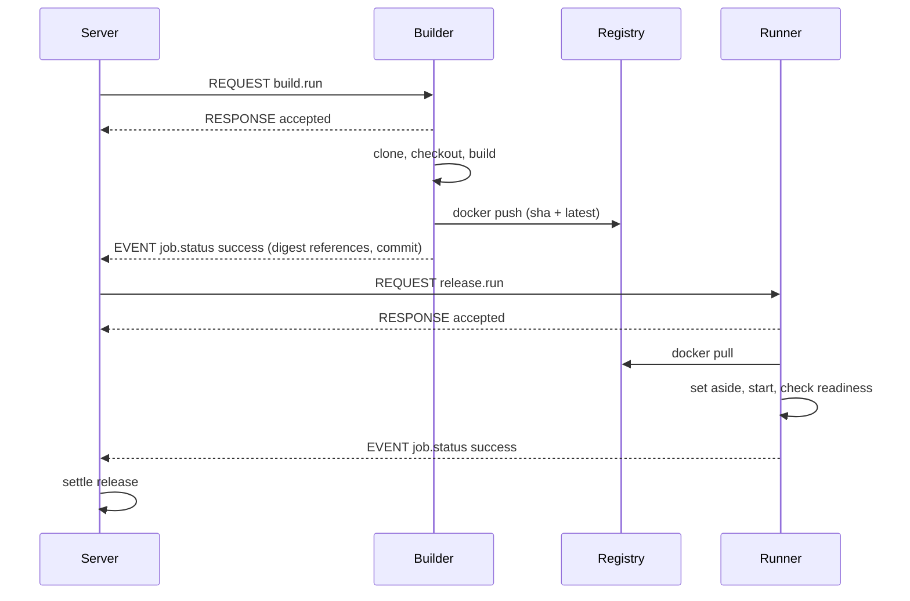

# Architecture

This document explains how URUFLOW is put together and why. It is written for contributors and for
engineers evaluating the design. For vocabulary, read [Core Concepts](concepts.md) first.

## 1. System Model

URUFLOW is a control plane that instructs agents. It holds no workloads itself, and agents make no
decisions.

The four panels are expanded in the sections below: the system model here, the wire format in
[UFP Protocol](protocol.md), and the flow in [Deployments](deployments.md).

Two properties define the system:

- **Build once, release the same artifact everywhere.** A commit is built exactly once. Every runner
  receives the identical image by immutable digest.
- **Agents connect outward.** The server never dials an agent, so agents may sit behind NAT. A
  disconnected agent is detected by the read deadline on the link, not by polling.

## 2. Component Responsibilities

| Package | Responsibility | Owns |
| :--- | :--- | :--- |
| `internal/ufp` | Wire contract: framing, envelopes, handshake, shared connection | Protocol constants and payload types |
| `internal/link` | Server side of the agent link | Sessions, event fan-out, metrics ingestion, alerts |
| `internal/pipeline` | Release orchestration across two stages | Release state transitions |
| `internal/projects` | Project file loading, writing, dotenv parsing | The file format |
| `internal/registry` | Registry container lifecycle and catalog | The `registry:2` deployment |
| `internal/pki` | Certificate authority and leaf certificates | All private keys |
| `internal/docker` | Docker Engine API client | Container and image operations |
| `internal/storage` | Persistence contract and SQLite implementation | The database schema |
| `internal/agent` | Agent daemon, builder, runner, metrics | Execution on a target machine |
| `internal/api` | Composition root, HTTP webhooks, project reload | Wiring |
| `internal/grammar` | Canonical workspace command schema | Syntax, help, validation and interaction metadata |
| `internal/ops` | Shared operational command engine | Typed command events |
| `internal/control` | Root-only local command transport | Unix socket and JSON event stream |
| `internal/cliui` | Human-readable operation output | Tables, panels, color and logs |
| `internal/workbench` | Single-page operations workspace | Transcript, prompt, confirmation and inline YAML input |

### Dependency Rules

`internal/ufp` depends on nothing else in the tree. It defines the contract both
sides implement, and a dependency from the protocol onto server or agent internals would make the two
sides impossible to evolve separately. Adding an import there should be treated as a design change.

`internal/ops` reads through `internal/api`. The workbench consumes its typed event stream through
`internal/control`; presentation does not own pipeline behavior. Operational commands exist inside
that one interface instead of being duplicated as external shell subcommands.

`internal/grammar` is the single command contract shared by `internal/ops` and `internal/workbench`.
Adding or changing a workspace command happens there once; help rows, usage errors, command discovery,
argument stages, resource completion, confirmation, and input mode all consume the same definition.

The server process is always the owner of the database, listeners, live agent sessions and command
actions. Clients send requests over the root-only local socket and receive JSON events. Detaching
removes only that subscriber and cannot interrupt agent connections or a release.

`internal/docker` is shared by the server (to run the registry) and the agent (to run workloads).
It knows nothing about projects or releases.

## 3. Authority Boundaries

Authority is enforced at the point of dispatch, not by convention.

| Actor | May | May Not |
| :--- | :--- | :--- |
| Server | Decide what to build and release; issue certificates; hold all state | Run workloads |
| Builder | Clone source, build images, push to the registry | Run released workloads unless it also holds the runner role |
| Runner | Pull images, run, stop, remove, stream logs | See source code, Dockerfiles, or build tooling |

An agent declares its roles in the handshake, and the server requires an exact match with the roles
stored at enrollment. The server and agent then enforce those roles independently for every operation.

### Where Things Exist

| Fact | Location | Survives server loss |
| :--- | :--- | :--- |
| Source code | Builder work directory only | Yes, but irrelevant |
| Images | Registry storage on the server | No — registry is a server-side container |
| Project definitions | Database, and `projects/` if file-backed | Files yes, database only with backups |
| Agent identity and key | Database, and agent config on the target | Agent side yes |
| Certificate authority | `<data_dir>/pki` | Only with backups |
| Running containers | Runner machines | **Yes** |

## 4. Deployment Lifecycle

Full detail in [Deployments](deployments.md). The architectural shape:

The request/response pair carries only acceptance. Progress and completion arrive as events, so a
long build never holds a request open.

## 5. State and Persistence

All server state is one SQLite file at `<data_dir>/uruflow.db`, opened with `MaxOpenConns(1)` and WAL
journalling. Eight tables: `agents`, `projects`, `releases`, `release_targets`, `release_logs`,
`containers`, `alerts`, `secrets`.

Two consequences of the single-writer model:

- Concurrency is resolved in Go, not in the database. The release-serialisation lock lives in
  `internal/pipeline`.
- Schema changes are additive. New columns are applied idempotently at open by checking
  `pragma_table_info`, so an existing database upgrades in place.

Container rows are **replaced wholesale** per agent on each metrics push rather than merged. State
converges to what the agent reports instead of drifting.

## 6. Agent Connectivity

One `ufp.Conn` type serves both sides of the link. The server and the agent run the same read loop,
the same envelope handling, and the same request correlation.

Ordering matters and is enforced by dispatch policy:

- **Events are handled inline**, in arrival order, because log lines must not reorder.
- **Requests are dispatched to a goroutine**, because a handler may take minutes.

Liveness is a read deadline. The server pings every 20 seconds; both sides fail a connection that
goes 60 seconds without a frame. There is no separate heartbeat bookkeeping.

## 7. Registry

The registry is an ordinary managed container, started by the same `internal/docker` client used for
workloads and labelled `uruflow.role=registry`. It is configured for TLS with a certificate from the
URUFLOW authority, `htpasswd` authentication with a generated password, and manifest deletion enabled.

Credentials and the CA certificate are pushed to every agent over the authenticated link at connect
time, so registry access is a consequence of agent enrolment rather than a separate distribution step.

## 8. Project Loading

Project files are expanded into ordinary projects at load time and written to the database. The
`source` column records their authoritative environment path; there is no second editable project
model in the interface.

Environments are a loader concern. `projects/api/dev.yaml` and
`projects/api/prod.yaml` become `api-dev` and `api-prod`, and the pipeline sees two ordinary projects.
Adding environments therefore required no change to the pipeline, runner, registry or schema beyond
two descriptive columns.

Loading never deletes. A project whose file has disappeared is reported as orphaned and left running.

## 9. Failure Recovery

Recovery belongs to whichever side still holds authority. The server closes out state it can no longer
account for; the runner owns the container in front of it.

- **The server reconciles before it serves.** On start, every agent is marked offline and any release
  still `building` or `releasing` is failed with `interrupted by a server restart`. This runs ahead of
  the registry and the link, so a release can never be observed in an impossible state.
- **A disconnect fails the work, not the workload.** A builder that drops fails the release; a runner
  that drops fails its own target and the release settles on the remaining ones. Containers already
  running are untouched.
- **A failed replacement is undone by the runner alone.** The set-aside container is renamed back and
  started without consulting the server, so recovery does not depend on the link surviving.
- **A server outage costs only new releases.** Agents retry every `reconnect_sec` and re-register when
  it returns.

The per-failure matrix, including what each failure does to the running service, is in
[Deployments](deployments.md#4-failure-boundaries).

## 10. Security Boundaries

Summarised here; stated fully with assumptions in [Security](security.md).

- One certificate authority signs both the agent link and the registry, so an agent installs one
  trust root.
- Agent authentication is HMAC challenge-response over TLS. The shared key never crosses the wire.
- The server process holds a Docker socket. Anyone who can run commands on the server host, or who
  obtains that socket, controls the fleet.

## 11. Design Constraints

Constraints that shaped the implementation and should be preserved:

1. **The protocol package stays dependency-free.** It is the contract.
2. **One release per project at a time.** Enforced in the pipeline, checked against stored state so it
   survives a restart. This is what keeps two builds off one working directory on a builder.
3. **Never delete implicitly.** Removing a project file, or losing an agent, does not tear down
   workloads.
4. **Only labelled containers are touched.** URUFLOW is a guest on machines that may run other things.
5. **Configuration has one authoritative location.** Project YAML is desired state; the database
   contains its loaded model and observed runtime state, never a competing editable definition.
6. **Presentation holds no pipeline logic.** The workbench renders typed command events and owns only
   interaction concerns such as history, confirmation, masked input and layout.

## 12. Where a Change Belongs

| Change | Package |
| :--- | :--- |
| New instruction from server to agent | `internal/ufp` (method + payload), then both handlers |
| New release stage or state transition | `internal/pipeline` |
| New field in a project file | `internal/projects` schema, then `internal/models` |
| Different container runtime behaviour | `internal/agent/runner` and `internal/docker` |
| New persisted fact | `internal/storage` contract, then `internal/storage/sqlite` |
| New workspace command or argument | `internal/grammar`, then its `internal/ops` handler |
| New workspace behavior or key binding | `internal/workbench` only |
