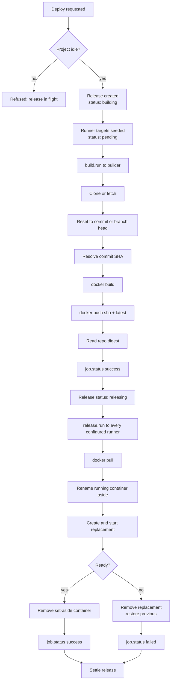
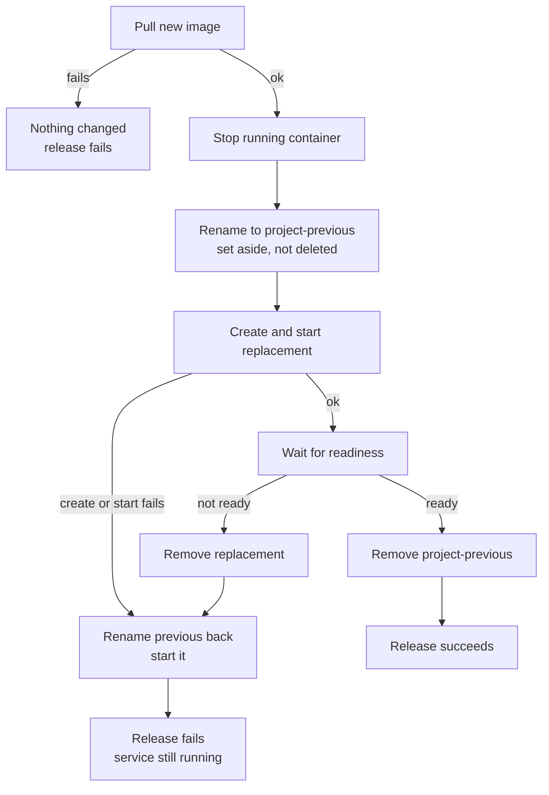

# Deployments

This document describes exactly what happens between requesting a deploy and a container serving
traffic, and what happens when each step fails. For the vocabulary, see [Core Concepts](concepts.md).

## 1. Triggering a Release

| Trigger | Source | Recorded as |
| :--- | :--- | :--- |
| Manual | `project deploy <name>` in the workspace | `manual` |
| Webhook | A push matching a project's git URL and branch | `webhook` |
| Rollback | `project rollback <name>` in the workspace | `rollback` |

Before a release is created the server checks, in order:

1. the project exists
2. **no other release for this project is in flight**
3. every configured runner exists, holds the `runner` role, and is online
4. when a build is needed, the configured builder exists, holds the `builder` role, and is online
5. prebuilt images use immutable digest references

A failure at any of these returns an error and creates nothing. In particular, a second deploy while
one is running is refused with `a release is already running for this project` — this is what keeps
two builds off the same working directory on a builder when a webhook lands during a manual deploy.

Each project has one total `timeout`, defaulting to `2h`. The clock starts when the release is created
and covers Git fetches, every service build, registry pushes, and deployment on all runners. Rollout
receives only the time remaining after the build; the timeout is never reset per service.

## 2. Lifecycle



### Stage 1 — Build

One builder, chosen by the project. The builder:

1. clones the repository, or fetches if the working directory already exists
2. resets hard to the requested commit, or to `origin/<branch>` when no commit was given
3. resolves `HEAD` to a full SHA
4. for each service that is built from source, runs `docker build` with that service's Dockerfile,
   context and build arguments
5. tags each image twice — with the **12-character commit SHA** and with `latest`
6. pushes both tags
7. reads each repository digest back from the registry

A project with no `services` block has exactly one build target. Services declaring a prebuilt
`image` are skipped here and pulled directly by the runners.

Every line of git and Docker output streams to the server as it happens and is stored against the
release.

The builder reports `job.status` with the digest references and resolved commit. The server accepts
that event only from the builder assigned to the active release and verifies every reference against
the expected repository before recording it.

### Stage 2 — Release

The server moves the release to `releasing` using the project snapshot captured when the release was
claimed, then dispatches `release.run` to each runner. Runners work
independently and in parallel. A runner that is offline at this moment is marked `skipped` rather than
failed.

Each runner pulls the image, replaces its container under the safety procedure below, and reports
`job.status`.

### Settling

A release completes when every target has reached a terminal state:

| Targets | Release outcome |
| :--- | :--- |
| All succeeded | `succeeded` |
| Any failed | `failed` — "one or more runners failed" |
| Any skipped | `failed` — "one or more runners were unavailable" |

The release records its duration and end time when it settles.

## 3. Release Safety

A runner never destroys what is running until the replacement has proven itself.



The image is pulled **before** anything is touched, so a bad reference or an unreachable registry
fails while the old container is still serving.

### Multiple Services

When a project declares several services, URUFLOW validates the dependency graph and replaces them in
dependency order. If any
service fails to become ready, every service already replaced in that release is restored in reverse
order before the release is reported failed.

A runner therefore either moves the whole project forward or leaves it exactly as it was. It never
ends up serving a mixture of old and new services.

Declared networks and volumes are checked or created idempotently before any image pull or container
replacement. External resources must already exist. URUFLOW does not delete networks or volumes when
a project is deleted because persistent data and shared networks are outside container rollback.

Services with `mode: job` run once with restart policy `no`. A `completed` dependency waits for a job
to exit zero; a non-zero exit or timeout fails the release before dependants start. Successful job
output is copied to the release log, and job containers are removed after completion or failure. Job
side effects, such as a completed database migration, cannot be rolled
back when a later service fails, so migrations must remain backward-compatible with the previous
application version.

### Readiness

When a service declares a native URUFLOW `healthcheck`, it is authoritative for release readiness:

- `http` sends `GET` to the configured path and accepts a `2xx` response
- `tcp` requires a successful TCP connection
- `command` uses Docker health status for the declared `CMD` or `CMD-SHELL` probe
- `running` requires an uninterrupted running period equal to `stable_for`

HTTP and TCP resolve the configured container port to its published host binding when present,
otherwise to the container's Docker network address. Each attempt has its own `timeout`; at most
`retries` attempts run, separated by `interval`. The release job's ten-minute context is the outer
bound. Connections and response bodies are closed after every attempt.

While a native check is active, Dockerfile `HEALTHCHECK` status is not combined with it. The native
policy is the sole readiness policy, though an exit, death or restart still fails readiness.

When no native healthcheck is configured, the previous behavior is unchanged. A replacement is
ready when:

- its image declares a `HEALTHCHECK` and the container reports **healthy**, or
- it declares none and the container has stayed **running** for **5 seconds**

It fails immediately, without waiting out the timeout, when the container:

- exits or dies — reported with its exit code
- reports **unhealthy**
- **restarts** during the wait, which is how a crash loop is caught under a restart policy

That fallback wait is capped at **2 minutes**.

Every readiness failure uses the same replacement safety path: the failed container is removed and
the set-aside container is renamed back and started. In a multi-service release, already replaced
services are restored in reverse order, preserving the all-or-nothing runner state.

### The Availability Gap

This is **not zero-downtime deployment**, and it should not be described as one.

A project owns a host port. The old and new containers cannot both hold it, so the old one must stop
before the new one starts. There is a gap between stopping the old container and the new one accepting
connections — measured at roughly **one second** for a small image on a local Docker daemon, and
longer for heavier images.

What the procedure guarantees is not zero downtime but that **a failed release does not leave you with
nothing running**. Removing the gap entirely requires a reverse proxy so the two containers can
overlap on different ports.

## 4. Failure Boundaries

| Failure | Where it stops | Effect on the running service |
| :--- | :--- | :--- |
| Clone or fetch fails | Build stage | None — nothing was touched |
| Build fails | Build stage | None |
| Push fails | Build stage | None |
| Pull fails on a runner | Before replacement | None on that runner |
| Container fails to create or start | After the old one was set aside | Previous container restored |
| Container exits immediately | Readiness check | Previous container restored |
| Native healthcheck exhausts retries | Readiness check, bounded by its settings and release context | Previous container restored |
| Docker image health never passes without a native check | Readiness check, within 2 minutes | Previous container restored |
| Container crash-loops | Readiness check, on first restart | Previous container restored |
| One runner fails, others succeed | Settling | Failed runner keeps its previous container; others run the new image. The release is marked failed. |
| Builder disconnects mid-build | Agent disconnect | Release fails with `builder disconnected` |
| Runner disconnects mid-release | Agent disconnect | That target fails; the release settles on the rest |
| Server crashes mid-release | Next server start | Release closed as failed with `interrupted by a server restart`; running containers untouched |
| Server unavailable | — | Containers keep running under their restart policy. Agents retry every `reconnect_sec`. No new releases can start. |

A partial rollout is possible and is reported honestly: runners that succeeded are on the new image,
runners that failed are on their previous one, and the release is `failed`. URUFLOW does not
automatically roll the successful runners back.

## 5. Rollback

Rollback takes the image reference from the project's last **successful** release and dispatches it
directly to the runners. The build stage is skipped entirely.

```text
release history          rollback
──────────────────       ────────────────────────
r3  failed               ─┐
r2  succeeded  api:8f2a  ─┴─▶ release r4, trigger rollback, image api:8f2a
r1  succeeded  api:1c9d
```

Because the recorded digest is immutable, what returns is byte-identical to what ran before. For a
multi-service release, every built-service digest and the original project snapshot are reused. No rebuild,
no git checkout, no chance of a different result from the same commit.

Rollback fails with `no successful release to roll back to` when the project has never had one.

## 6. Stop and Remove

| Action | Effect |
| :--- | :--- |
| Stop | After confirmation, stops the container on every configured runner. The image remains; a later release or rollback restarts it. |
| Delete | Removes the container from every configured runner and deletes the project. Images stay in the registry. |

Both require every configured runner to be online. A failed or unreachable runner prevents deletion,
so URUFLOW never forgets a project while leaving an unmanaged container behind. Neither touches images.

## 7. Observing a Release

Every release displays its stage inline:

```text
● build ── ● push ── ◉ release      building, rolling out
● build ── ● push ── ● release      live
✘ build ── – push ── ○ release      failed during build
```

Opening a release shows its per-runner outcome and the full log, with build and release output
interleaved in the order it arrived.

Log lines emitted while an agent is disconnected are **not** buffered — they are dropped. A gap in a
release log usually means the link dropped, and the release status will say so.

For what to do when a release fails, see [Troubleshooting](troubleshooting.md).
