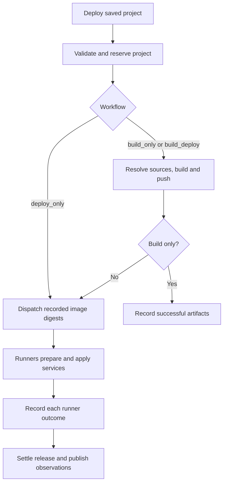

# Deployments

A release is the server's record of a build, rollout or restore attempt. This page follows a release from the browser request to runner outcomes and current workload observations.

## Start a release

Choose **Deploy** on a project to release its saved definition. The server checks the project, active-release reservation, required secrets, image references, agent roles and connectivity before claiming work.

Only one release may own a project at a time. The database records the specification and runner targets for that attempt. Later configuration edits do not replace that recorded specification.

```mermaid
flowchart TD
    request[Deploy saved project] --> validate[Validate and reserve project]
    validate --> workflow{Workflow}
    workflow -->|build_only or build_deploy| build[Resolve sources, build and push]
    workflow -->|deploy_only| deploy[Dispatch recorded image digests]
    build --> buildonly{Build only?}
    buildonly -->|Yes| artifacts[Record successful artifacts]
    buildonly -->|No| deploy
    deploy --> runners[Runners prepare and apply services]
    runners --> outcomes[Record each runner outcome]
    outcomes --> settle[Settle release and publish observations]
```

Project deadlines and workflow requirements are defined in [Build and runtime model](native-build-model.md#project-fields).

## Build artifacts

For each source-built service, the assigned builder fetches its repository and branch, resolves the commit, and runs Docker with that service's Dockerfile, context and build arguments. Shared repository and branch inputs reuse a checkout.

The builder pushes the commit tag and `latest`, then reads the repository digest. The server checks the reporting agent, expected repository, digest format and service coverage before recording artifacts. Prebuilt services already carry their digest references.

Build output streams through UFP into persisted release logs. `build_only` finishes after successful artifact publication. `build_deploy` continues to the recorded runners. `deploy_only` begins with runner dispatch.

## Readiness and replacement

Each runner:

1. Validates the request and prepares declared networks and volumes.
2. Pulls every required image before container replacement begins.
3. Follows dependency order for services and jobs.
4. Stops and renames an existing owned service container aside.
5. Creates its replacement and waits for readiness.
6. Removes the previous containers after the runner's complete service sequence succeeds.

The old container stops before its replacement starts. On replacement failure, the runner removes the new container and attempts to restore the previous one. If a later component fails, it restores earlier replacements in reverse order and reports any restoration error.

A native `http`, `tcp`, `command` or `running` healthcheck is the chosen readiness policy. The [model reference](native-build-model.md#readiness) owns probe fields and defaults. Without a native policy, Docker image health is used when present; otherwise the service must stay running for five seconds. This fallback is bounded by two minutes and the release context. Exit, unhealthy state or a restart fails the wait.

Failed startup output is copied to the release log before the replacement is removed. Inspect that log even when the failed container no longer appears in inventory.

## Jobs and resources

Jobs run with restart policy `no`, must exit zero, and capture their output before container cleanup. A failed or timed-out job stops dependent work. Container restoration does not reverse completed database changes; migration jobs should remain compatible with the previous application.

Networks and volumes are prepared separately from containers and persist after replacement or project container removal. External resources must exist before a runner can use them.

## Read the result

UFP request acceptance means the agent accepted work. The release completes only after its stages and runner outcomes settle.

| Outcome     | Meaning                                                                 |
| ----------- | ----------------------------------------------------------------------- |
| `building`  | Source and artifact work is in progress                                 |
| `releasing` | Runtime work is in progress on targets                                  |
| `succeeded` | Required stages and all targets succeeded                               |
| `failed`    | A stage failed, a target failed or a required runner became unavailable |

Targets retain their own status and message. Runners work independently, so a failed release can include successful targets running the new version. Use those outcomes and current observations to choose the next action.

On server startup, unfinished releases are closed as failed with `interrupted by a server restart`. The server marks agent observations offline until connections return. Current container inventory is refreshed by agent reports.

## Restore a successful release

Choose **Rollback** on the project or **Restore release** on an eligible release. The server creates a new release with trigger `rollback`, reuses the selected successful release's recorded images and specification, and skips source builds. The current project supplies the total timeout for the new attempt.

The runner follows the same preparation, readiness and replacement sequence. Retain the registry artifacts referenced by releases you may restore.

## Stop workloads

**Stop** stops the project's managed containers on its configured runners. The project must be idle and the required runners connected. Persistent volumes and registry artifacts remain available.

## Triggering and observation

The current service-based project schema selects sources per service and is deployed explicitly from the browser. The separate webhook listener validates provider requests and delivery IDs; its configuration and response behavior are documented in [Configuration](configuration.md#webhook-listener).

Open a release to inspect progress, runner targets, artifacts, its saved specification and logs. Open the project to compare that result with current runtime observations. Closing a browser tab leaves the release running.

Implementation: `internal/pipeline`, `internal/link`, `internal/agent/builder` and `internal/agent/runner`.

Related: [Projects](projects.md), [Operations](operations.md), [Troubleshooting](troubleshooting.md).

Rollback choices use project history, including the latest successful artifact releases when they are older than the recent history window. Runtime health does not change which recorded release a container belongs to.
