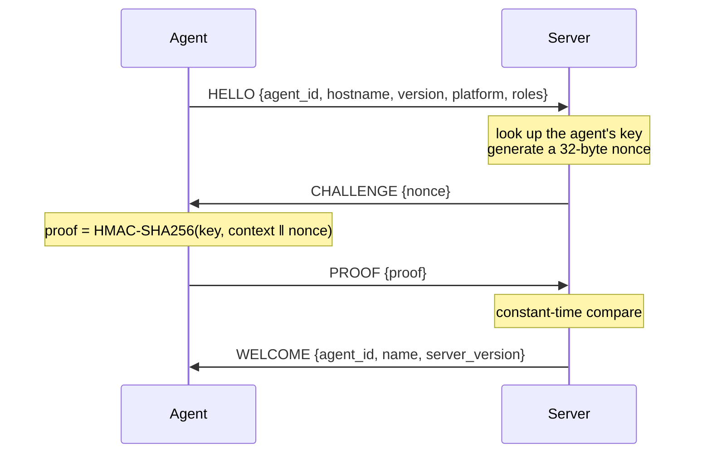

# UFP Protocol

UFP is the protocol the URUFLOW Server and its agents speak. You do not need this document to operate
URUFLOW. It exists for contributors changing the wire contract and for engineers auditing the link.

## 1. Why It Exists

Agents need three things at once: an instruction channel, a live log stream, and immediate detection
when a peer disappears. HTTP polling gives none of them well, and running a command over SSH per
operation gives no streaming and no connection awareness.

UFP is a persistent, bidirectional, framed connection over TLS. It carries:

- instructions that expect an acknowledgement — build this, release that
- one-way streams — log lines, metrics, status changes
- liveness

The design goal is a contract small enough to read in one sitting. Adding a capability should add a
method or topic name, not a frame type.

## 2. Transport

TCP with TLS 1.3. There is no plaintext mode.

The agent verifies the server against the URUFLOW certificate authority and expects the fixed server
name `uruflow-server`, which is always present in the server certificate. Pinning a logical name
rather than a hostname means the link works on any address without reissuing certificates.

The server does not authenticate the agent with a client certificate. Agent identity is established
by the handshake described below.

## 3. Framing

Every message is an 8-byte header followed by a JSON payload.

```text
 0        1        2        3        4                                7
 ┌────────┬────────┬────────┬────────┬────────────────────────────────┐
 │  0x55  │  0x46  │  0x04  │  type  │      payload length (u32 BE)   │
 │  'U'   │  'F'   │  ver   │        │                                │
 └────────┴────────┴────────┴────────┴────────────────────────────────┘
```

| Field | Size | Value |
| :--- | :--- | :--- |
| Magic | 2 bytes | `0x55 0x46` |
| Version | 1 byte | `0x04` |
| Frame type | 1 byte | See below |
| Payload length | 4 bytes | Unsigned, big-endian |

A frame is rejected if the magic does not match, the version is not `0x04`, or the declared length
exceeds **16 MiB**. Payloads are JSON, so frames remain readable in a packet capture.

## 4. Frame Types

Frame types are grouped by nibble.

| Range | Group | Frames |
| :--- | :--- | :--- |
| `0x01`–`0x05` | Handshake | `HELLO`, `CHALLENGE`, `PROOF`, `WELCOME`, `REJECT` |
| `0x10`–`0x12` | Messaging | `REQUEST`, `RESPONSE`, `EVENT` |
| `0x20`–`0x22` | Liveness | `PING`, `PONG`, `GOODBYE` |

Grouping is for human readability when reading a dump; the protocol does not branch on the range.

## 5. Envelopes

Everything after the handshake travels in one of three envelopes.

```json
REQUEST   {"id": 7, "method": "build.run", "payload": { ... }}
RESPONSE  {"id": 7, "ok": true,            "payload": { ... }}
EVENT     {"topic": "job.log",             "payload": { ... }}
```

Adding a capability means adding a `method` or `topic` string. No new frame type is required, and old
peers reject unknown names cleanly rather than mis-parsing them.

### Request and Response

A `REQUEST` carries a caller-assigned `id`. The peer replies with a `RESPONSE` carrying the same `id`
and an `ok` flag. A failed response carries `{"message": "..."}` as its payload.

Correlation is a map from `id` to a waiting caller. Responses that arrive for an unknown `id` are
dropped. Closing the connection releases every waiter.

Requests are answered with acceptance, not completion. `build.run` returns as soon as the builder has
taken the job; the build itself reports through events. Long work therefore never holds a request open
and never collides with a read deadline.

### Events

One-way, unacknowledged. Flows needing completion use a correlated status event rather than a reply.

| Direction | Topic | Carries |
| :--- | :--- | :--- |
| Server → Agent | `registry.config` | Registry address, credentials, CA certificate |
| Agent → Server | `registry.ready` | Registry trust and builder login completed successfully |
| Agent → Server | `job.log` | One line of build or release output |
| Agent → Server | `job.status` | Stage transition: running, success, failed |
| Agent → Server | `metrics.push` | System metrics, snapshot validity, and managed container state |
| Agent → Server | `container.log` | One line from a followed container |

### Methods

All are server to agent.

| Method | Effect |
| :--- | :--- |
| `build.run` | Resolve one or more Git sources, build targets, push digests; report images and commits through `job.status` |
| `release.run` | Ensure resources, pull immutable images, execute jobs, and replace services in dependency order |
| `release.stop` | Stop every managed container for a project |
| `release.remove` | Remove every managed container for a project; persistent resources remain |
| `logs.follow` | Begin streaming a container's output as `container.log` |
| `logs.stop` | Stop streaming |

## 6. Handshake



Any step may be answered with `REJECT {reason}` instead, after which the connection closes.

### Authentication Properties

The shared key never crosses the wire. Four properties matter:

- **Context binding.** The proof is `HMAC-SHA256(key, "uruflow-agent-auth-v1" ‖ nonce)`. The context
  label is folded in before the nonce, so a proof produced for one purpose cannot be replayed as
  another if further contexts are added later.
- **Replay resistance.** The nonce is 32 bytes of `crypto/rand` per connection. A captured proof is
  useless on the next connection.
- **Constant-time comparison.** Verification uses `hmac.Equal`, so a wrong key does not leak how much
  of the proof was correct.
- **Uniform rejection timing.** An unknown agent id is verified against a fixed placeholder key rather
  than short-circuiting, so timing does not reveal whether an id exists.

### Role Declaration

The agent declares its roles in `HELLO`. The declaration must exactly match the roles stored during
enrollment; unknown, duplicate, missing or additional roles reject the connection. The server checks
the enrolled role for job events and dispatch, and the agent independently rejects disallowed methods.

## 7. Connection Lifecycle

```text
dial TLS → handshake → server pushes registry.config → serve loop → close
```

After `WELCOME` the server sends `registry.config` immediately, so an agent is able to reach the
registry before it is asked to do anything.

The serve loop:

- `PING` is answered with `PONG` by the read loop itself
- `GOODBYE` ends the loop cleanly
- `RESPONSE` resolves a waiting request
- `EVENT` is handled **inline, in order** — log lines must not reorder
- `REQUEST` is handled **in a goroutine** — a handler may run for minutes

Both sides tear down the connection when the loop exits. On the agent this cancels in-flight builds,
releases, maintenance operations and log streams before reconnecting after `reconnect_sec`. A project
accepts only one active agent job, and a repeated job id is acknowledged without starting it twice.

## 8. Liveness

| Timer | Value | Applies to |
| :--- | :--- | :--- |
| Handshake timeout | 10s | Each handshake read |
| Write timeout | 15s | Every frame write |
| Ping interval | 20s | Server only |
| Idle timeout | 60s | Read deadline on both sides |

Liveness is the read deadline. Because the server pings every 20 seconds and the agent answers, a
healthy connection always sees traffic well inside 60 seconds. No separate heartbeat state is kept.

## 9. Error Behaviour

| Condition | Result |
| :--- | :--- |
| Bad magic, version, or oversized length | Connection error; the link drops |
| Malformed top-level envelope JSON | Frame skipped, connection continues |
| Malformed payload for a known event | Connection error |
| Unknown method | `RESPONSE` with `ok: false` and a message |
| Unknown topic | Connection error |
| Response for an unknown id | Dropped |
| Unexpected frame type | Connection error |

Malformed envelopes are tolerated while malformed *frames* are fatal, because a bad frame means the
stream is no longer aligned.

## 10. Versioning

The version byte is `0x04`. A peer speaking `0x01`, `0x02`, or `0x03` is rejected at the first frame,
so an older agent cannot half-connect and silently ignore native resource, dependency, job, command,
security, or multi-source fields.

Within UFP, compatibility is managed through names:

- adding a method or topic is backward compatible
- adding an optional payload field is backward compatible
- changing the meaning of an existing method, topic, or field is not, and requires a version bump

## 11. Invariants

Hold these when changing the protocol:

1. `internal/ufp` imports nothing else from the repository.
2. A request answers acceptance, never completion.
3. Events are ordered; requests are not.
4. The key is never transmitted, logged, or written to a response.
5. Both sides validate roles independently.
6. Payloads stay JSON — debuggability is a feature of this protocol.
