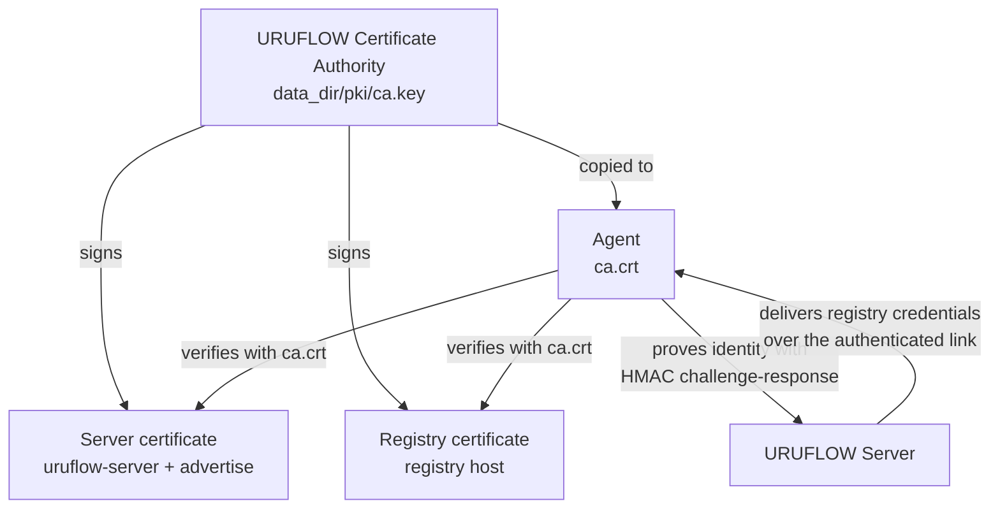

# Security Model

This document states what URUFLOW protects, how, and — as importantly — what it assumes. It is
written to let you decide whether the model fits your environment, not to reassure you.

## 1. Trust Model in One Picture



One authority signs both the agent link and the registry. An agent therefore installs exactly one
trust root, and registry access becomes a consequence of enrolment rather than a separate credential
distribution problem.

## 2. Trust Root

The authority is generated on first start and lives at `<data_dir>/pki/ca.key`, mode `0600`. It is
valid for ten years; issued certificates for five.

**This key is the root of all trust in the deployment.** Anyone holding it can impersonate the server
to every agent and the registry to every puller. It is also unrecoverable: losing it means reissuing
and redistributing a new CA to every machine.

The server certificate always carries the logical name `uruflow-server` alongside `localhost`,
`127.0.0.1` and the configured `advertise` value. Agents pin the CA and expect the logical name, which
means the link keeps working when the server's address changes without reissuing anything.

## 3. Agent Link

TLS 1.2 or later, always. There is no plaintext mode and no skip-verify option.

The server does not use client certificates. Agent identity is established by challenge-response:

```text
agent  ──HELLO {agent_id, roles}────────────────▶  server
agent  ◀─CHALLENGE {32-byte nonce}──────────────   server
agent  ──PROOF {HMAC-SHA256(key, ctx ‖ nonce)}─▶  server
agent  ◀─WELCOME───────────────────────────────    server
```

Properties, each verifiable in `internal/ufp`:

| Property | How |
| :--- | :--- |
| The key never crosses the wire | Only the HMAC of a server-chosen nonce is sent |
| Replay resistance | A fresh 32-byte `crypto/rand` nonce per connection |
| Context binding | The label `uruflow-agent-auth-v1` is folded in ahead of the nonce |
| No partial-match leak | Comparison uses `hmac.Equal`, which is constant time |
| No id enumeration by timing | An unknown agent id is verified against a fixed placeholder key rather than returning early |

The agent key is a shared secret. It sits in `agent.yaml` on the target machine and in the database on
the server. Anyone who can read either can impersonate that agent.

## 4. Role Enforcement

An agent declares its roles in the handshake. Enforcement happens twice, independently:

- the **server** refuses to dispatch `build.run` to an agent that never claimed `builder`
- the **agent** refuses a `build.run` it was not configured for

Neither side relies on the other being correct. The practical effect is a boundary on source-code
exposure: a runner-only agent cannot be instructed to clone a repository, so machines that only run
workloads never receive source or build tooling.

## 5. Registry

The registry runs with TLS using a URUFLOW-signed certificate and `htpasswd` authentication with a
generated password stored using bcrypt.

Credentials and the CA certificate are delivered to agents over the already-authenticated link. They
are not written into project files or passed on command lines.

A builder installs the CA into `/etc/docker/certs.d/<registry>/ca.crt` and runs `docker login` itself.
Both require root; see [Operations](operations.md#agent-permissions).

Registry credentials are attached **only** to pulls whose image belongs to the URUFLOW registry. A
service using a public image such as `redis:7-alpine` is pulled anonymously, so the registry password
is never presented to Docker Hub or any other host.

Anonymous requests are refused with `401`, and a client that does not trust the URUFLOW CA cannot
complete the TLS handshake.

## 6. Webhooks

| Host | Header | Verification |
| :--- | :--- | :--- |
| GitHub | `X-Hub-Signature-256` | HMAC-SHA256 over the raw body, compared in constant time |
| GitLab | `X-Gitlab-Token` | Constant-time comparison against the secret |

An invalid signature is refused with `401`. **If `webhook.secret` is empty, verification is skipped and
any request is accepted** — that is a deliberate escape hatch for local testing and must not be used
on a reachable network.

The webhook endpoint can start a build of any auto-deploy project. Treat the secret as a deployment
credential.

## 7. Secrets

URUFLOW provides a secret store for values that must not appear in files or on screen. Secrets are
stored from the interface only — press `7`, then `n` — so a value is never passed on a command line
and never enters shell history.

A project references it as `${secret:api_db_url}` in an ordinary variable. The reference is resolved
when a release is dispatched.

### What Is Protected

| Property | How |
| :--- | :--- |
| Encrypted at rest | AES-256-GCM; ciphertext in the database |
| Key storage | `<data_dir>/pki/secrets.key`, mode `0600`, generated on first use |
| Not deterministic | A fresh nonce per value, so identical secrets have different ciphertext |
| Tamper detection | GCM authentication rejects modified ciphertext |
| Never displayed | The interface shows the reference and a mask, never the value |
| Never in files | Project files carry the reference, so they are safe to commit |
| Not in logs | Resolution happens at dispatch; values never enter a release log |
| Fails closed | A missing secret fails the deploy before any build starts |

### What Is Not Protected

**Resolved values reach the runner in plaintext.** They must — Docker needs the value to start a
container. Consequently:

- the value is visible in `docker inspect` on that runner, as with any container variable
- anyone with a shell on a runner can read the variables of workloads on that machine
- protection is at rest on the server and in transit over TLS, not on the execution plane

**Ordinary variables are still plaintext.** Only values you deliberately move into the secret store
are encrypted. Anything written directly in a `.env` file or a project remains readable.

**Losing the key file loses every secret.** `pki/secrets.key` cannot be reconstructed. It joins
`ca.key` as material that must be backed up — see [Operations](operations.md#backup-and-restore).

## 8. Docker Socket

Both the server and every agent hold a Docker socket.

**Access to a Docker socket is equivalent to root on that host.** A process that can talk to it can
start a privileged container mounting the host filesystem. This is a property of Docker, not of
URUFLOW, but it defines the blast radius:

| Compromise | Consequence |
| :--- | :--- |
| The server host | Full control of the fleet: state, CA, registry, and the ability to deploy anything to every runner |
| A runner host | Root on that machine and its workloads |
| A builder host | Root on that machine, plus source code for every project it builds |
| The CA key | Impersonation of the server and registry |
| An agent key | Impersonation of that agent |

Run agents on machines you already trust with your workloads. There is no sandbox between an agent and
its host.

## 9. Access Control

URUFLOW has **no user accounts, no roles for humans, and no audit log.**

The control surface is the terminal interface, which runs on the server host. Access control is
therefore whoever can log into that host — a small, simple, and easily reasoned-about model, provided
you treat server shell access as equivalent to full deployment authority.

The HTTP listener exposes only two routes: the webhook path and `/health`. There is no HTTP API for
managing projects, agents or releases, so there is no remotely reachable management surface to
misconfigure.

If you add one, put authentication in front of it from the first commit. A management API on a host
holding a Docker socket is remote code execution when it is wrong.

## 10. Assumptions

State these plainly, because the model depends on them:

1. The server host is trusted and its shell access is restricted.
2. Agent machines are trusted with the workloads they run.
3. The network between server and agents may be hostile — this is why TLS and challenge-response
   exist — but the machines at each end are not.
4. Anyone permitted to define a project is permitted to run arbitrary code on the runners assigned to
   it, because a Dockerfile is arbitrary code.
5. Environment variables are not secrets.
